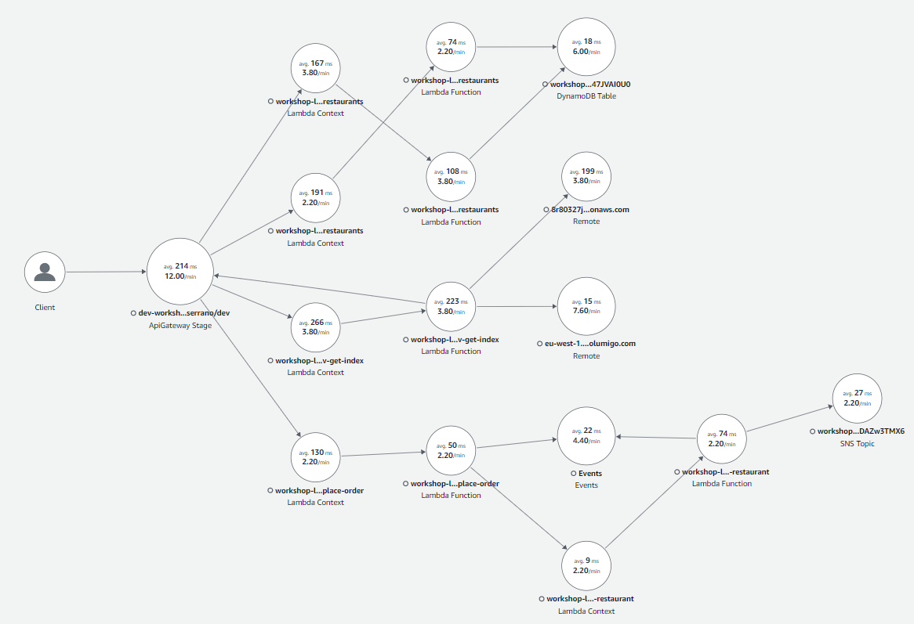
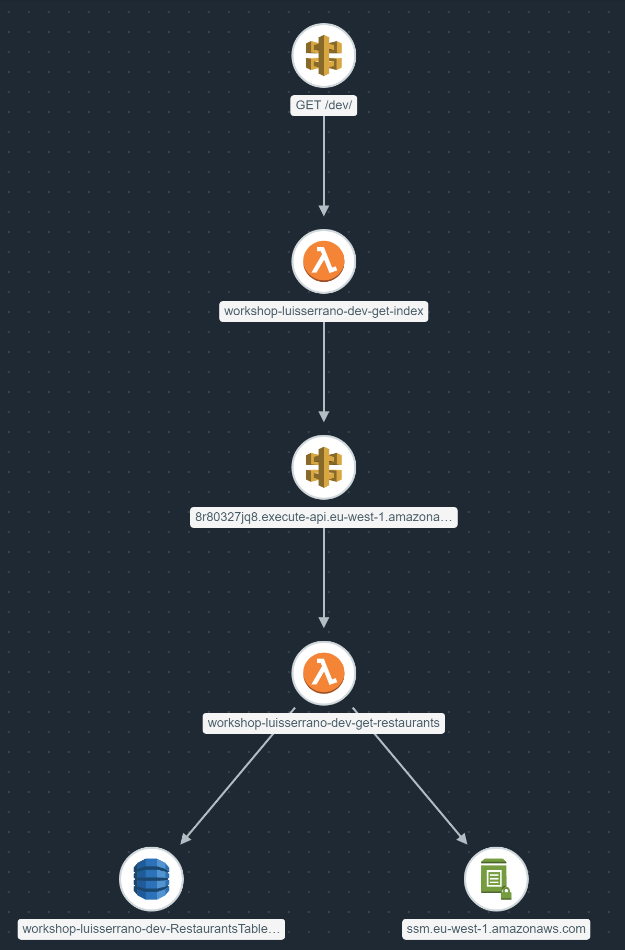

# Summary of Work

This workshop is divided into 4 parts (and weeks).

The parts and steps below have been adapted based on the original roadmap, its suggested extras, and some extras that I have explored.

## Part 1 - Building REST APIs

- Webpage Server-side rendering with restaurants search by theme
  - Decoupling of services with `serverless-export-env`
- Lambda API endpoints for listing and searching restaurants
- DynamoDB restaurant data seeding and storage
- Cognito User Pool user registration
- API Gateway `/search` endpoint secured with IAM

## Part 1 (Optional Extra Work)

- Consider caching at CloudFront level vs API Gateway caching
  - API Gateway caching via `serverless-api-gateway-caching`
- API Gateway throttling via `serverless-api-gateway-throttling`
- Request validation via API Gateway for the POST `/search` endpoint
- Enable detailed CloudWatch metrics
- Custom CloudWatch metrics via `aws-embedded-metrics` using EMF (Embedded Metric Format) underneath
- Separate Serverless resources across multiple files
- Web Application Firewall (WAF) rate-based limiting rules and `serverless-associate-waf`
- Alerts and CloudWatch Dashboards with `serverless-plugin-aws-alerts`
  - Automated Dashboard
  
  - Custom Log-based Alarm - Trigger on 100+ cartoon searches within a period
  

## Part 2 - Testing and CI/CD

- Integration tests
  - Local invocation, using external dependencies
  - `jest` and `@types/jest` for test specs
  - `cheerio` for HTML parsing
  - `awscred` for resolving AWS credentials and signing of HTTP requests with AWS IAM roles
  - `lodash` for mirroring behavior of HTTP client `axios` which will be later used in implementation of acceptance tests
  - Additional libs like `cross-env` and `uuid`
- Acceptance tests
  - Remote invocation (via endpoint)
  - `aws4` for signing requests with our IAM credentials
  - `chance` for generating random names
  - Invoking endpoints protected by a Cognito custom authorizer (using Cognito Server Client Id)
- CI/CD with GitHub Actions
  - AWS Identity Provider and Role configuration for allowing the repository's GitHub Action(s) access
  - GitHub Workflow for deploying temporary environments, run all tests, and deploy
  - `@middy/core` and `@middy/ssm` for integrating with AWS Systems Manager (SSM) Parameter Store (requires AWS SDK v3 SSM: `@aws-sdk/client-ssm` which only comes pre-bundled in Node.js 18+ Lambda runtimes)
  - Consuming (dynamically) and Outputting AWS SSM Parameters
  - Securely handle secrets using custom KMS keys

## Part 2 (Extra Work (beyond requested))

- Update CloudFormation template to include necessary SSM parameters
- Update CI/CD to use temporary environments for running integration and acceptance tests
- Update CI/CD to apply seeded data into the fresh temporary environment with every run
- Fix timeout problem in CI/CD due to Middy's cache system interfering with Jest (Made a GitHub contribution about this. I've created PR [Update Testing docs with importance of disabling cache #996](https://github.com/middyjs/middy/pull/996) in Middy's repository proposing that this is added to the documentation page, and updated the associated issue [Middy 4.1.0 causes Jest test runner to never exit. #990](https://github.com/middyjs/middy/issues/990#issuecomment-1407457224) with a reference to it. This was accepted and merged on same day and is now part of the official Middy's Test documentation page)
- Attempted to automate configuration of Custom KMS key and SSM SecureString in Parameter store, but since CloudFormation doesn't support it (for good practice reasons), there was no easy way of doing this without going way beyond the scope of this workshop, so the KMS Key and the SSM SecureString must be configured by hand (and in a way that is good to prevent breaches from occurring)
- Other things left to explore:
  - Add Middy's validator middleware to implement response validation, to add to the already existing/added serverless' request schema validation models
  - Use `sts:AssumeRole` to mitigate the risk of leaked CI credentials

## Part 3 - Processing events in real-time

- Setup a custom EventBridge Bus and Simple Notification System (SNS) topics
- EventBridge Producer and Consumers (with Lambda Functions)
- Integration and Acceptance Tests
  - Acceptance Tests using conditional infrastructure references by vars exported via `serverless-export-outputs` plugin
- Real-time visualization of SNS notifications and EventBus events with [lumigo-cli](https://www.npmjs.com/package/lumigo-cli) (global/local dependency) with commands:
  - `tail-sns`
  - `tail-eventbridge-bus`
- Move each provider level IAM role to a function-specific dedicated IAM role to minimise the attack surface

## Part 4 - Observability

- Structured JSON logging (with `dazn-lambda-powertools`)
- Sample of 1% of debug logs in production (with `lambda-powertools-pattern-basic`)
  - `@dazn/lambda-powertools-middleware-sample-logging` sampling of debug logs
  - `@dazn/lambda-powertools-middleware-correlation-ids` extracting of correlation IDs (the `debug-log-enabled` field also allows this at the user transaction level)
  - `@dazn/lambda-powertools-middleware-log-timeout` emits an error message for when a function times out (which otherwise wouldn't automatically happen)
- Enable distributed tracing with X-Ray
  - Instrumenting AWS SDK with `aws-xray-sdk-core` and associated code changes
  - Instrumenting HTTP calls for the built-in `https` module
- Apply connection reuse optimization (with provider env var `AWS_NODEJS_CONNECTION_REUSE_ENABLED: "1"`) (default in AWS SDK v3, but not for v2)
- `@dazn/lambda-powertools-correlation-ids` for auto-generated correlation IDs
  - Forward correlation IDs with a number of `dazn-lambda-powertools` like-for-like replacement packages for AWS:
    - through EventBridge events with `@dazn/lambda-powertools-eventbridge-client`
- Custom correlation IDs
- Auto-instrumenting with the `serverless-lumigo` plugin
- Powertuning Lambda functions with [aws-lambda-power-tuning tool](https://github.com/alexcasalboni/aws-lambda-power-tuning) and [lumigo.io](https://lumigo.io)
  - Optimized memory value for get-restaurants lambda function [(see result)](https://lambda-power-tuning.show/#gAAAAQACAAQACMAL;MZi3Q4eWPUP/xqhCrPz1QmTiuUK+JjRC;aXJPNSQ2VjW1qT81e6wKNqizUTYFWBg2)
    
    ```json
    {
      "power": 512,
      "cost": 7.140000000000001e-7,
      "duration": 84.38866666666667,
      "stateMachine": {
        "executionCost": 0.0003,
        "lambdaCost": 0.0010359415499999998,
        "visualization": "https://lambda-power-tuning.show/#gAAAAQACAAQACMAL;MZi3Q4eWPUP/xqhCrPz1QmTiuUK+JjRC;aXJPNSQ2VjW1qT81e6wKNqizUTYFWBg2"
      }
    }
    ```

#### X-Ray Service Map Views (Icon and Metric)




#### Lumigo Transaction Views

| Lumigo transaction get-index                                             | Lumigo transaction search-restaurants                                                      | Lumigo transaction place-order                                               |
|--------------------------------------------------------------------------|--------------------------------------------------------------------------------------------|------------------------------------------------------------------------------|
|  |  |  |

## Part 4 and Wrap Up Extras

- Overall automation changes, improvements and fixes to allow full environment setup automation
- `serverless-plugin-extrinsic-functions` plugin for additional expressive `Fn::` conditions to use in `serverless.yml`
- Documentation of deviations from workshop's initially expected path
